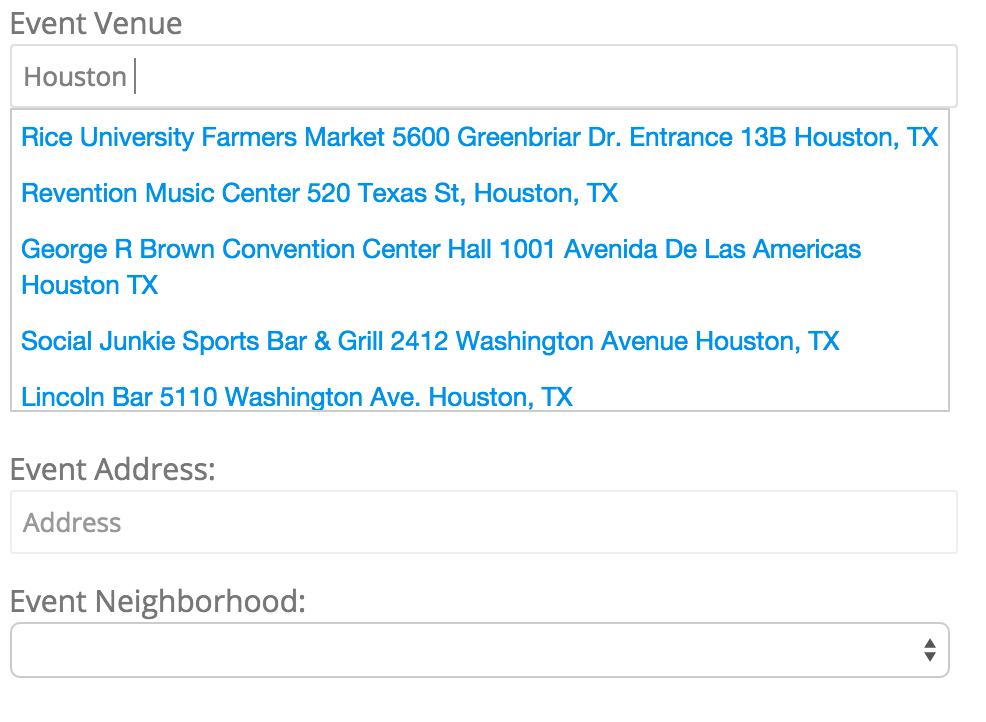
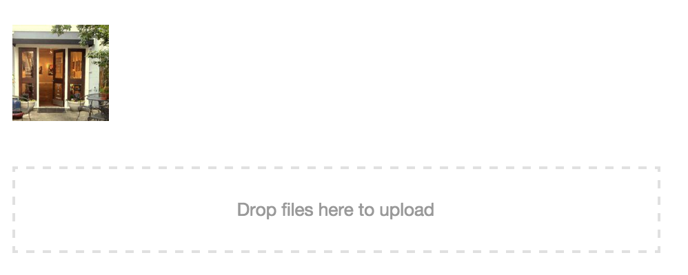
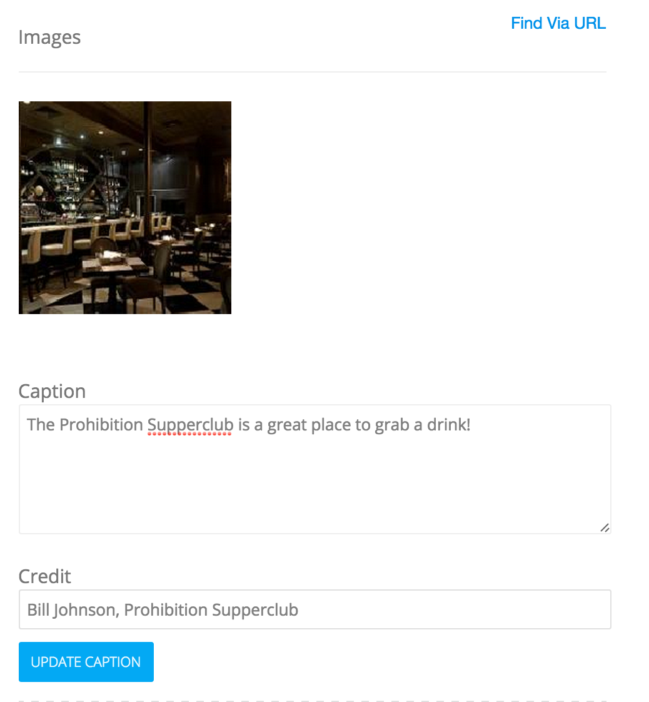

# Managing Events
Managing the details of individual events is handled primarily through two interfaces in the admin - the events list and the events details views. The former is for finding events and/or applying bulk actions and the latter for modifying more minute details and meta data around individual events and their recurrences.

# The Events List
If you are using Pointslocal exclusively for events, the first page you'll reach when you get to the admin is the events list page. This gives you a paginated search interface for finding events, editing individual events as well as performing batch operations on large groups of events.

## User Queue
The User Queue - represented by one of the three primary buttons at the top of the events list page - represents user-submitted events. Depending on your setup, this can serve as a reference for events that are set to go live on submission or require being set to "published" to be available on your site.

## Your Queue
Your Queue - also one of the primary buttons on the events list - represents a working collection of events that can be utilized for print export, batch operations, compiling an editorial package or simply workflow clarity.

## Batch Operations

In the events list, by selecting any number of events with the corresponding checkbox, a dropdown menu of batch operations will slide open. These represent the most common actions for

### Queue
By selecting Queue, you'll add the selected events to your working group of events.

### Set Publish Status
Set Print Published, Set Web Published and Set Web & Print Published allow quick access to setting multiple publication statuses. This can also be done individually by clicking the globe icon (for web) or the A icon (for print).

### Merge
Merging an event means taking the maximum amount of information from two or more events and combining it into a single instance. This is most commonly used when duplicate events are submitted. Pointslocal will attempt to prevent duplication on imports but allows users to submit duplicates if they choose to ignore the "your event may already be in our system" message. This is a destructive operation, which means that some information will be lost in most cases. For example, if both events have a URL but the URL is not the same, the merge process will take the first event submitted's value, destroying the second (and successive) event's value.

### Connect
Connect is utilized when an event is a recursion of an existing event - this allows the metadata for both to be shared. It also allows the event to show in "more dates" on the event details page. Like Merge, Connect is destructive - by connecting an instance to an existing event, the meta data around the event will yield to the existing event's meta data.

### Delete
Delete will remove the event instance from the system, *but not the event itself*. This is a partially destructive operation as it will remove solely the date of the event and not the metadata surrounding that event. You can find events with no dates associated with them by selecting "Inactive" from the list of options in the advanced search dropdown.

# Editing an Event

The edit event panel presents all of the standard and custom fields for editing an event and one of its associated date recurrences. It's important to note that, aside from the date and time, all of the fields in this view apply to *all* instances or recurrences of a given event.

## Primary Descriptive Fields
By default, an event has four descriptive fields for print, web or both. A title (and optional print title) refer to a short summary of a given event. The description (and optional print description) include the rest of the detail. Depending on your setup, you may choose not to use one or either of the print fields and instead defer to the web versions.

## Primary and Additional Categories
These represent the categorical associations with a given event. Depending on your presentation, there may be no practical use for a primary category, although it is often used for the *most* applicable category to an event. It is also sometimes used for displaying just one category for the web (instead of a full list of categories).

## Publish Controls
Both Web and Print Published statuses can be controlled using the checkboxes near the bottom of the form.

## Date & Time
As mentioned earlier, these are the only fields tied directly to an instance or occurence of an event rather than the event's core info. An event may end on the same day or a future day for multi-day events.

By selecting "No Start Time", you indicate an open-ended start of an event.  This is rare, but might apply to an event described as starting at sun-up or mid-morning.

By selecting "No End Time", you indicate an open-ended end for an event.  This is more common for events that don't have a set end time.

By selecting both of the above, you indicate an "all-day" event, or an event without a clear start or end.

## Recurrence
The recurrence section on the event gives you details on the number of additional times that event occurs and the ability to manage recurrence.  See: Event Recurrence for more info.

## Featured Status
Here you can see if an event has been upgraded as a featured event or set it internally as a featured event.  See Featured Events for more info.

## Contact Info
This section of meta data largely refers to phones, emails and URLs associated with an event.  It will also show the event submitter's email and/or phone number if the event was submitted via UGC on the web site.  By clicking on "More Details" you can find the user's browser info and IP, which can be useful for troubleshooting and/or blocking certain abusive users from submitting events in the future.

## Venue

Here you can connect the event to an existing venue or override that by creating a new venue.  When you type into the venue field, you'll get some suggestions in a dropdown that will allow you to select an existing venue if it matches the entered text.  If not - and if paired with an address - the venue will be created and added into the venues database.

You can also select a venue but override the address by entering a distinct address into the Event Address field.

Selecting a neighborhood under Event Neighborhood will take the geographic center point of that neighborhood and associate that latitude and longitude coordinate with the event.  It exists as a very inaccurate way to funnel an event into a neighborhood filter.

## Tags
Tags are completely free-form editorial tools for organizing content.  There is no hierarchy nor standard that defines how they should be used, although common usages are for "Editor's Picks", "Great For Kids" or "Rainy Day."  By clicking Suggest you will get recommendations from existing events that have been tagged.

## Images

The images section allows addition, deletion and re-ordering of images.  To upload images, either click the "Drop files here to upload" box or drag and drop images into that space.  As images are uploaded, square thumbnails will appear above - these can be dragged and reordered.  This is useful when curating the order of a gallery or for choosing the primary image (the first image will appear on searches and lists).

If a URL is associated with an event, clicking the "Find Via URL" link will surface images on an event - this is useful for acquiring an image without tracking down images or manually downloading from an event web site.

Mousing over an image will give two options - the ability to edit the image's metadata (caption and credit) or to delete the image.  Deletion of images cannot be undone.  Credits and captions are optional values.

